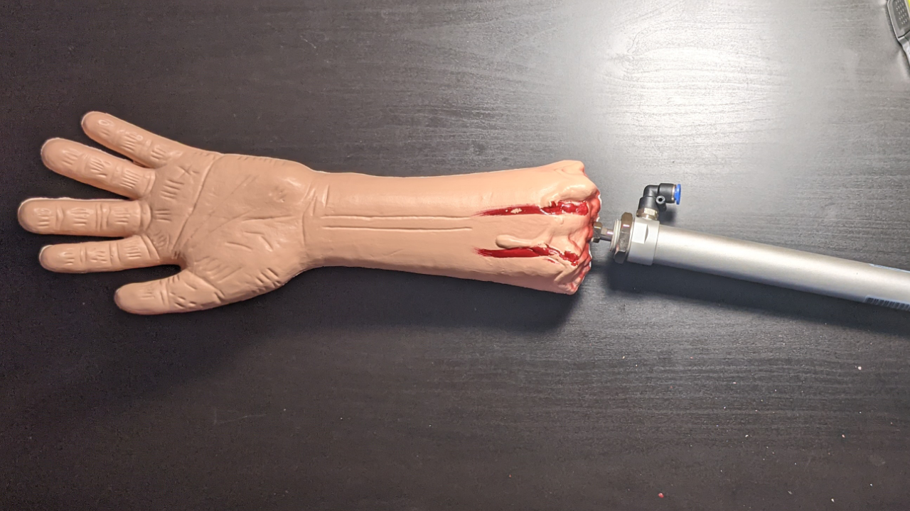

# Raspberry Pi Zombie Arm
This repository contains the code for running my zombie arm project; an arm that reaches out from the ground at trick or treaters when a person is detected.

Happy Halloween!
